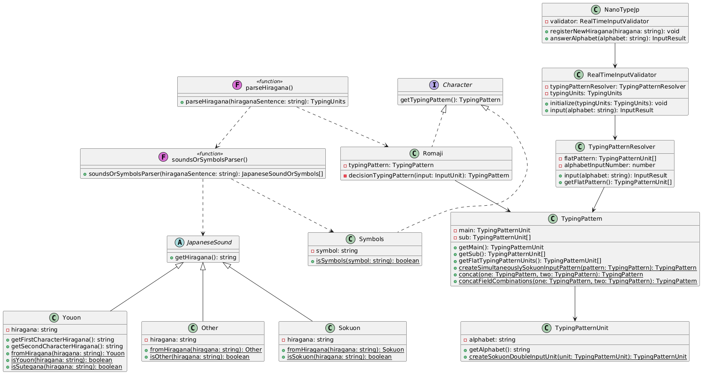

# NanoTypeJp - 日本語タイピングライブラリ

## 概要

NanoTypeJp は、日本語タイピングゲーム作成のための JavaScript ライブラリです。ひらがなをローマ字入力に変換し、タイピングの正誤判定を行うことができます。

## 特徴

- ひらがなの文章をローマ字入力パターンに変換
- 複数の入力パターンに対応（例：「し」→ "si"/"shi"/"ci"）
- 記号入力に対応
- タイピング成功・失敗のカウント機能
- ノーミスで文章を入力完了した場合のカウント機能

## インストール方法

npm に公開しているため、npm install でインストールできます。

```bash
npm i @shsk002/nano-type-jp
```

umd 形式でも公開しているため、HTML から直接ライブラリを読み込むことも可能です。

https://www.jsdelivr.com/package/npm/@shsk002/nano-type-jp

```html
<script
  type="text/javascript"
  src="https://cdn.jsdelivr.net/npm/@shsk002/nano-type-jp/dist/nano-type-jp.umd.js"
></script>
```

## 基本的な使い方

```typescript
import NanoTypeJp from "nano-type-jp";
// インスタンスの作成
// メモ：umd形式のscriptを読み込んだ場合はwindowにNanoTypeJpクラスが挿入されています
const game = new NanoTypeJp();
// ひらがなの登録
const result = game.registerNewHiragana("こんにちは");
// タイピング判定
const answer = game.answerAlphabet("k");
if (answer.result === "correct") {
  console.log("正解！");
} else if (answer.result === "fail") {
  console.log("不正解...");
} else if (answer.result === "complete") {
  console.log("入力完了！");
}
```

## 入力結果の型定義

answerAlphabet メソッドを実行した際、下記データが返却されます。
データに合わせてゲーム画面を更新してください。

```typescript
type AnswerResult = {
  result: "correct" | "fail" | "complete";
  failCount: number; // 失敗回数
  correctCount: number; // 成功回数
  completedCount: number; // 完了した回数
  perfectStreakCount: number; // ノーミスで文章を入力完了した回数
  inputAlphabet: {
    completedInputAlphabet: string; // 入力済みアルファベット
    remainedAlphabet: string; // 残りの入力アルファベット
  };
};
```

## 対応している入力パターン

### 基本的なひらがな

- 清音（あ、い、う、え、お...）
- 濁音（が、ぎ、ぐ、げ、ご...）
- 半濁音（ぱ、ぴ、ぷ、ぺ、ぽ）
- 促音（っ）

### 拗音

- きゃ、しゅ、ちょ など
- ゔぁ、ゔぃ、ゔぇ、ゔぉ

### 記号

- 句読点
- かっこ
- スペース
- その他の一般的な記号

## 開発者向け情報

### プロジェクト構造

- `/src/typing/` - メインのタイピング機能
- `/src/japaneseSounds/` - 日本語音声クラス（Other、Youon、Sokuon）
- `/src/romaji/` - ローマ字変換関連
- `/src/parseHiragana/` - ひらがな解析



## ライセンス

MIT

## バグ報告・機能要望

GitHub の Issue にて受け付けています。
